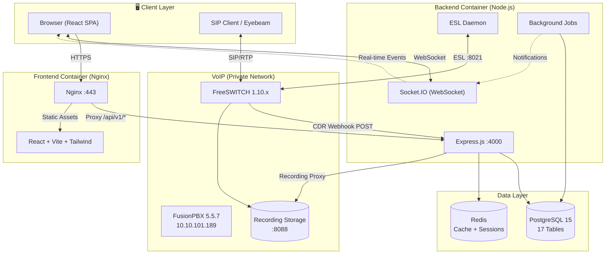
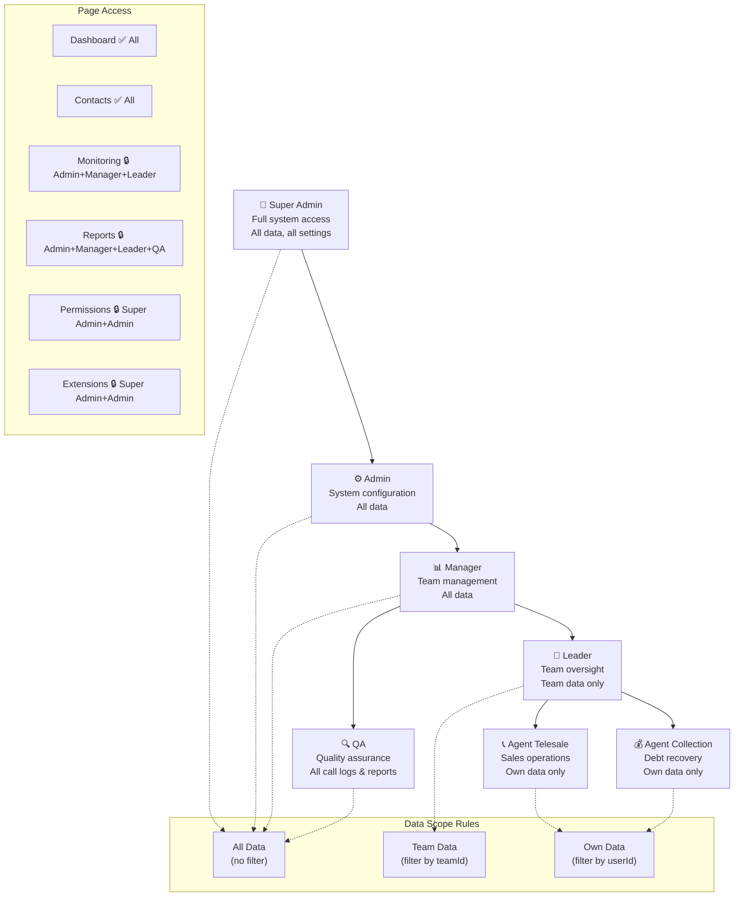
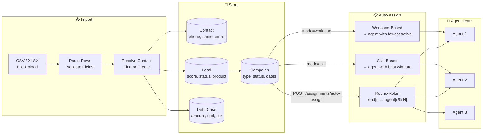
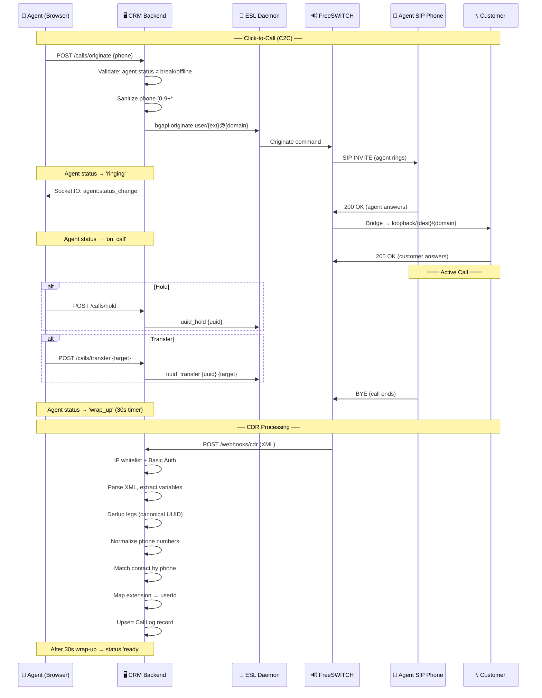
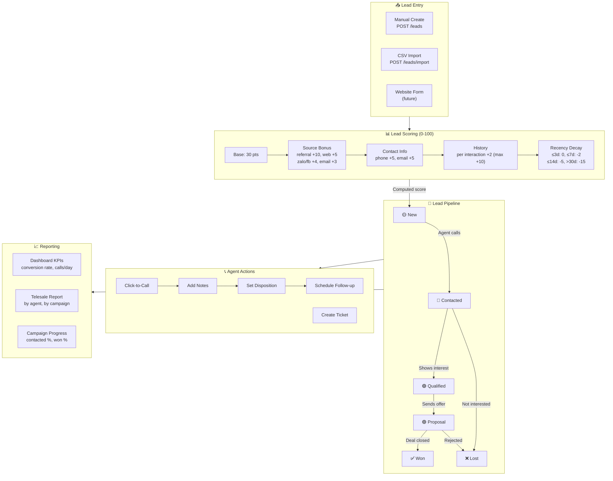
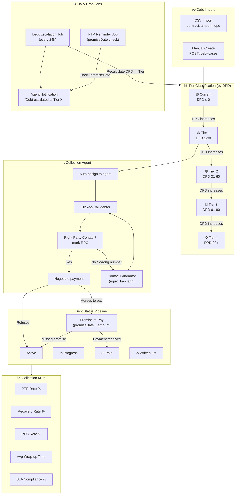
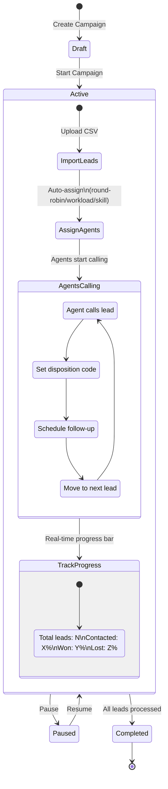
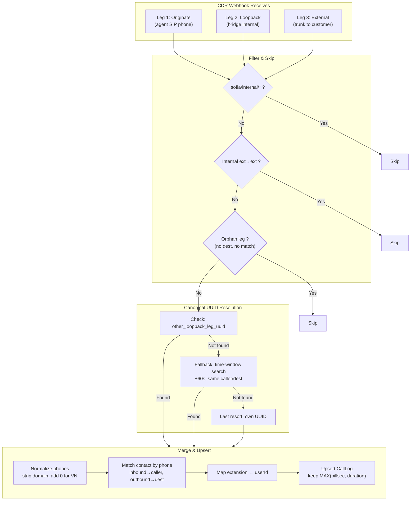
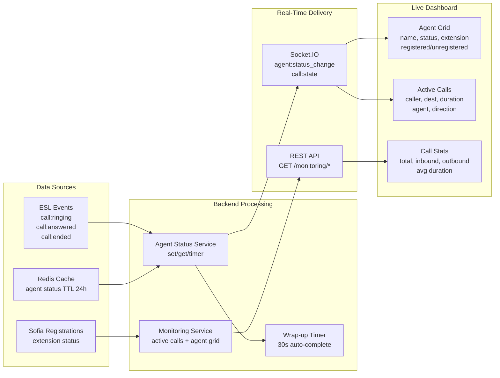
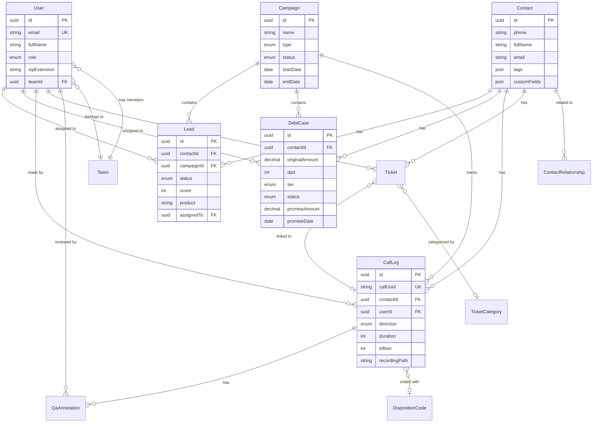

# CRM Omnichannel — Workflow Diagrams

## 1. Overall System Architecture

## 2. User Role Hierarchy & Data Access

## 3. Data Import & Assignment Flow

## 4. Call Flow End-to-End

## 5. Lead Management Flow

## 6. Debt Collection Flow

## 7. Campaign Lifecycle

## 8. CDR Deduplication Logic

## 9. Real-Time Monitoring Flow

## 10. Database Entity Relationships

