# PRD Visual Diagrams — CRM Omnichannel Telesale & Collection

> Auto-generated from PRD v2.0 · Mermaid format

---

## 1. System Architecture Overview

```mermaid
graph TB
    subgraph Frontend["CRM Frontend (React + Vite + TypeScript)"]
        UI[Agent Workspace UI]
        CTC[Click-to-Call UI]
        CC[Call Controls]
        WR[WebRTC Softphone<br/>SIP.js / JsSIP]
        DASH[Dashboard / KPI]
    end

    subgraph Backend["CRM Backend (Express.js + TypeScript)"]
        API[REST API<br/>/api/v1/*]
        CDR_WH[CDR Webhook<br/>Receiver]
        REC_PROXY[Recording Proxy<br/>RBAC + Stream]
        ESL_D[ESL Daemon<br/>Node.js]
        WS[Socket.IO<br/>WebSocket Server]
    end

    subgraph Storage["Data Layer"]
        PG[(PostgreSQL 15+<br/>Prisma ORM)]
        REDIS[(Redis<br/>Pub/Sub + Cache)]
    end

    subgraph PBX["FusionPBX / FreeSWITCH 1.10.x"]
        ESL_S[ESL Server<br/>:8021]
        SIP[SIP/WSS<br/>:7443]
        CDR_M[xml_cdr Module]
        REC_S[Recordings<br/>/var/lib/freeswitch/recordings/]
        PG_PBX[(PostgreSQL<br/>v_xml_cdr)]
        NGINX_PBX[Nginx :8088<br/>Recording Server]
    end

    subgraph External["External Services"]
        TURN[coTURN<br/>STUN/TURN]
        ZALO[Zalo OA API]
        SMS[SMS Gateway]
        AI[AI API<br/>OpenAI / Claude]
    end

    UI -->|HTTP/REST| API
    UI -->|WebSocket| WS
    WR -->|WSS :7443| SIP
    WR -->|STUN/TURN| TURN

    API --> PG
    API --> REDIS
    WS --> REDIS

    ESL_D -->|TCP :8021| ESL_S
    CDR_M -->|HTTP POST| CDR_WH
    REC_PROXY -->|HTTP :8088| NGINX_PBX
    NGINX_PBX --> REC_S

    API -->|Fallback CDR query| PG_PBX

    API --> ZALO
    API --> SMS
    API --> AI

    style Frontend fill:#e1f5fe,stroke:#0288d1
    style Backend fill:#fff3e0,stroke:#f57c00
    style Storage fill:#e8f5e9,stroke:#388e3c
    style PBX fill:#fce4ec,stroke:#c62828
    style External fill:#f3e5f5,stroke:#7b1fa2
```

---

## 2. Click-to-Call Flow

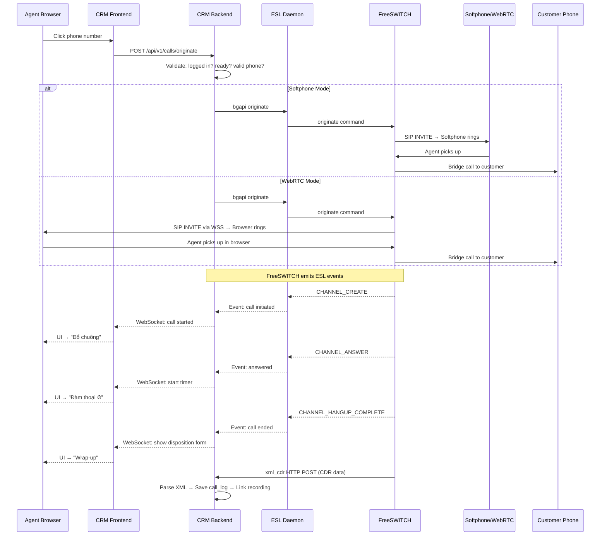

---

## 3. Inbound Call Flow

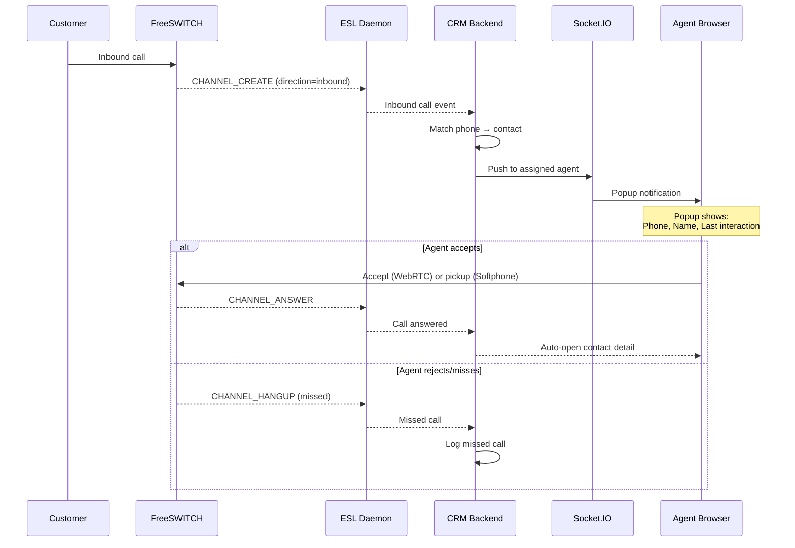

---

## 4. Agent State Machine

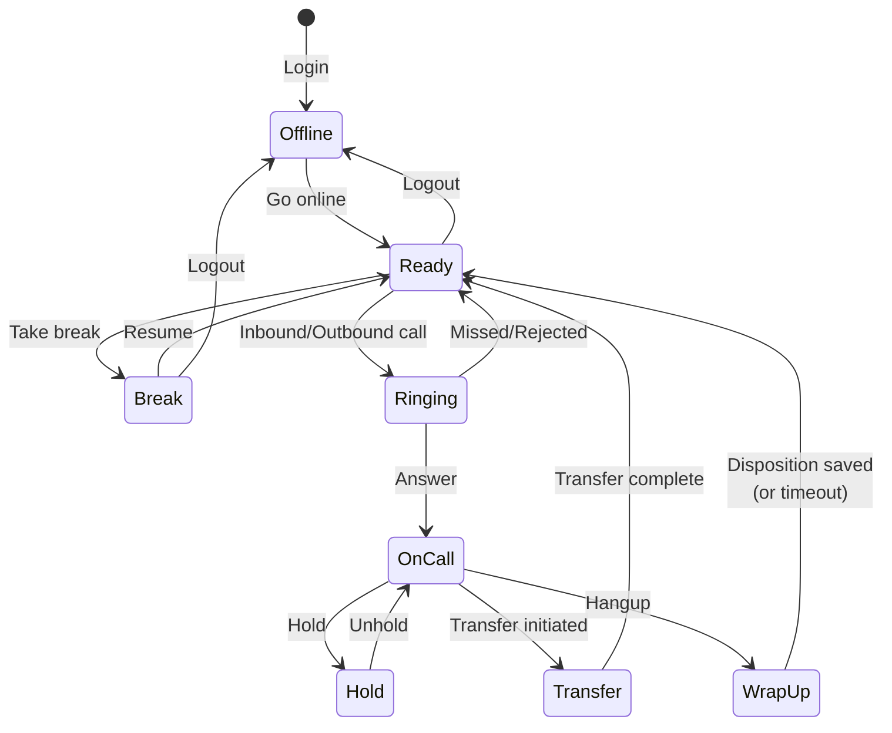

---

## 5. Database ER Diagram

```mermaid
erDiagram
    teams ||--o{ users : "has members"
    teams {
        uuid id PK
        varchar name
        uuid leader_id FK
        enum type "telesale | collection"
        boolean is_active
    }

    users ||--o{ contacts : "assigned_to"
    users ||--o{ leads : "assigned_to"
    users ||--o{ debt_cases : "assigned_to"
    users ||--o{ call_logs : "makes calls"
    users ||--o{ tickets : "creates"
    users ||--o{ qa_annotations : "reviews"
    users ||--o{ agent_status_logs : "tracks status"
    users ||--o{ audit_logs : "performs actions"
    users ||--o{ notifications : "receives"
    users {
        uuid id PK
        varchar email UK
        varchar password_hash
        varchar full_name
        enum role "admin|manager|qa|leader|agent_ts|agent_col"
        uuid team_id FK
        varchar sip_extension
        enum call_mode "webrtc | softphone"
        enum status "active | inactive"
    }

    contacts ||--o{ leads : "has leads"
    contacts ||--o{ debt_cases : "has debts"
    contacts ||--o{ call_logs : "call history"
    contacts ||--o{ tickets : "has tickets"
    contacts ||--o{ contact_relationships : "related to"
    contacts {
        uuid id PK
        varchar full_name
        varchar phone
        varchar phone_alt
        varchar email
        varchar id_number
        date date_of_birth
        enum gender
        varchar source
        jsonb tags
        jsonb custom_fields
        uuid assigned_to FK
        uuid created_by FK
    }

    campaigns ||--o{ leads : "contains"
    campaigns ||--o{ debt_cases : "contains"
    campaigns ||--o{ call_logs : "tracks"
    campaigns ||--o{ campaign_disposition_codes : "uses"
    campaigns {
        uuid id PK
        varchar name
        enum type "telesale | collection"
        enum status "draft|active|paused|completed"
        date start_date
        date end_date
        text script
        uuid created_by FK
    }

    leads {
        uuid id PK
        uuid contact_id FK
        uuid campaign_id FK
        enum status "new|contacted|qualified|proposal|won|lost"
        int score
        uuid assigned_to FK
        timestamp next_follow_up
        text notes
        varchar lost_reason
        decimal won_amount
        text ai_summary
    }

    debt_cases {
        uuid id PK
        uuid contact_id FK
        uuid campaign_id FK
        decimal original_amount
        decimal outstanding_amount
        int dpd
        enum tier "current|dpd_1_30|dpd_31_60|dpd_61_90|dpd_90_plus"
        enum status "active|in_progress|promise_to_pay|paid|written_off"
        uuid assigned_to FK
        date promise_date
        decimal promise_amount
        text ai_summary
    }

    call_logs ||--o{ qa_annotations : "reviewed by"
    call_logs ||--o{ tickets : "linked to"
    call_logs {
        uuid id PK
        varchar call_uuid UK
        uuid contact_id FK
        uuid user_id FK
        uuid campaign_id FK
        enum direction "inbound | outbound"
        varchar caller_number
        varchar destination_number
        timestamp start_time
        timestamp answer_time
        timestamp end_time
        int duration
        int billsec
        varchar hangup_cause
        uuid disposition_code_id FK
        varchar recording_path
        enum recording_status "available|failed|none"
        text ai_transcript
        text ai_summary
        jsonb ai_score
    }

    disposition_codes ||--o{ call_logs : "categorizes"
    disposition_codes ||--o{ campaign_disposition_codes : "used in"
    disposition_codes {
        uuid id PK
        varchar code UK
        varchar label
        enum category "telesale|collection|both"
        boolean is_final
        boolean requires_callback
        boolean is_active
        int sort_order
    }

    tickets {
        uuid id PK
        uuid contact_id FK
        uuid call_log_id FK
        uuid user_id FK
        uuid category_id FK
        varchar subject
        text content
        varchar result_code
        enum status "open|in_progress|resolved|closed"
        enum priority "low|medium|high|urgent"
    }

    ticket_categories ||--o{ tickets : "categorizes"
    ticket_categories {
        uuid id PK
        varchar name
        uuid parent_id FK
        boolean is_active
        int sort_order
    }

    qa_annotations {
        uuid id PK
        uuid call_log_id FK
        uuid reviewer_id FK
        int score
        jsonb criteria_scores
        text comment
        jsonb timestamp_note
    }

    macros {
        uuid id PK
        varchar name
        text content
        varchar category
        varchar shortcut
        uuid created_by FK
        boolean is_global
        boolean is_active
    }

    contact_relationships {
        uuid id PK
        uuid contact_id FK
        uuid related_contact_id FK
        enum relationship_type
        varchar notes
    }

    notifications {
        uuid id PK
        uuid user_id FK
        enum type
        varchar title
        text message
        varchar reference_type
        uuid reference_id
        boolean is_read
    }

    audit_logs {
        uuid id PK
        uuid user_id FK
        varchar action
        varchar entity_type
        uuid entity_id
        jsonb changes
        varchar ip_address
    }

    agent_status_logs {
        uuid id PK
        uuid user_id FK
        enum status "offline|ready|break|ringing|on_call|hold|wrap_up|transfer"
        varchar reason
        timestamp started_at
        timestamp ended_at
        int duration
    }

    webhook_logs {
        uuid id PK
        varchar source
        varchar call_uuid
        text raw_payload
        enum status "received|processed|failed|unmatched"
        text error_message
    }

    campaign_disposition_codes {
        uuid campaign_id PK
        uuid disposition_code_id PK
        boolean is_active
        int sort_order
    }
```

---

## 6. Telesale Lead Pipeline

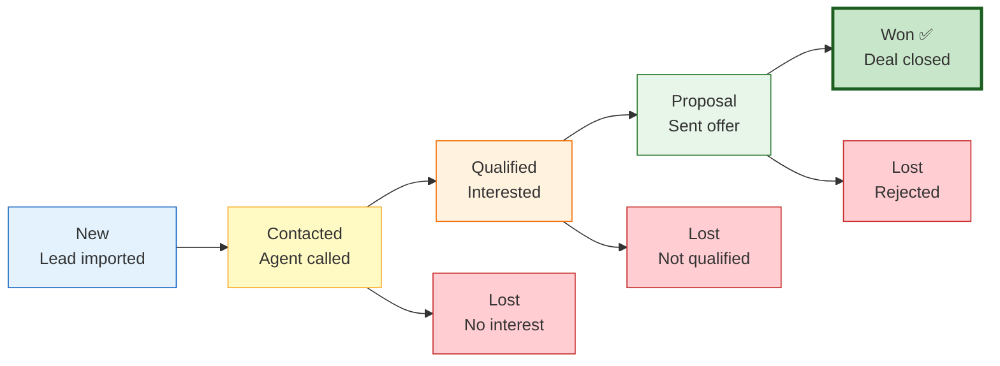

---

## 7. Collection Debt Lifecycle

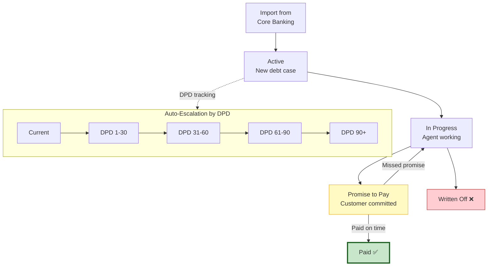

---

## 8. RBAC Access Matrix

```mermaid
graph TB
    subgraph Roles
        ADMIN[Admin<br/>Full access]
        MGR[Manager<br/>All data + reports]
        QA_R[QA<br/>All recordings + scoring]
        LEAD[Team Leader<br/>Team data only]
        ATS[Agent Telesale<br/>Own data only]
        ACOL[Agent Collection<br/>Own data only]
    end

    subgraph Permissions
        USERS[Manage Users]
        CONTACTS[View All Contacts]
        CAMPAIGNS[Manage Campaigns]
        CALLS[Click-to-Call]
        REC_ALL[Recordings: ALL]
        REC_TEAM[Recordings: Team]
        REC_SELF[Recordings: Self]
        MONITOR[Live Monitoring]
        BARGE[Barge/Whisper]
        QA_ANN[QA Annotation]
        EXPORT[Export Reports]
        AI_CFG[AI/Automation Config]
    end

    ADMIN --> USERS
    ADMIN --> CONTACTS
    ADMIN --> CAMPAIGNS
    ADMIN --> CALLS
    ADMIN --> REC_ALL
    ADMIN --> MONITOR
    ADMIN --> BARGE
    ADMIN --> QA_ANN
    ADMIN --> EXPORT
    ADMIN --> AI_CFG

    MGR --> CONTACTS
    MGR --> CAMPAIGNS
    MGR --> CALLS
    MGR --> REC_ALL
    MGR --> MONITOR
    MGR --> BARGE
    MGR --> QA_ANN
    MGR --> EXPORT
    MGR --> AI_CFG

    QA_R --> CONTACTS
    QA_R --> REC_ALL
    QA_R --> QA_ANN
    QA_R --> EXPORT

    LEAD --> REC_TEAM
    LEAD --> CALLS
    LEAD --> QA_ANN
    LEAD --> EXPORT

    ATS --> REC_SELF
    ATS --> CALLS

    ACOL --> REC_SELF
    ACOL --> CALLS
```

---

## 9. Phased Delivery Roadmap

```mermaid
gantt
    title CRM Omnichannel — Phased Development
    dateFormat YYYY-MM-DD
    axisFormat %b %d

    section Phase 1 — MVP (6-8w)
    Auth & RBAC               :p1a, 2026-04-01, 1w
    CRUD Contacts/Leads/Debt  :p1b, after p1a, 2w
    Click-to-Call Softphone   :p1c, after p1a, 2w
    ESL Integration           :p1d, after p1c, 1w
    xml_cdr Webhook + CDR     :p1e, after p1d, 1w
    Call Logs & Recording     :p1f, after p1e, 1w
    Tickets & Disposition     :p1g, after p1b, 1w
    Agent Status & Dashboard  :p1h, after p1f, 1w
    Import/Export + Notif     :p1i, after p1g, 1w
    Audit Logging + QA        :p1j, after p1h, 1w

    section Phase 2 — Growth (6-8w)
    WebRTC In-Browser         :p2a, after p1j, 2w
    Campaign Management       :p2b, after p1j, 2w
    Lead Scoring & Follow-up  :p2c, after p2b, 1w
    Manager Dashboard + KPI   :p2d, after p2a, 2w
    Listen/Whisper/Barge      :p2e, after p2a, 1w
    QA Annotation System      :p2f, after p2e, 1w
    Macros + Reports Export   :p2g, after p2c, 1w
    Zalo OA + SMS Automation  :p2h, after p2d, 2w

    section Phase 3 — AI (8-12w)
    AI Speech-to-Text         :p3a, after p2h, 2w
    AI Call Summary + Score   :p3b, after p3a, 2w
    AI Script Suggestion      :p3c, after p3b, 2w
    AI Chatbot                :p3d, after p3a, 3w
    AI Callbot                :p3e, after p3d, 3w
    Workflow Builder          :p3f, after p3c, 2w
    FB Messenger + Live Chat  :p3g, after p3e, 2w
```

---

## 10. CDR Data Flow (Recommended)

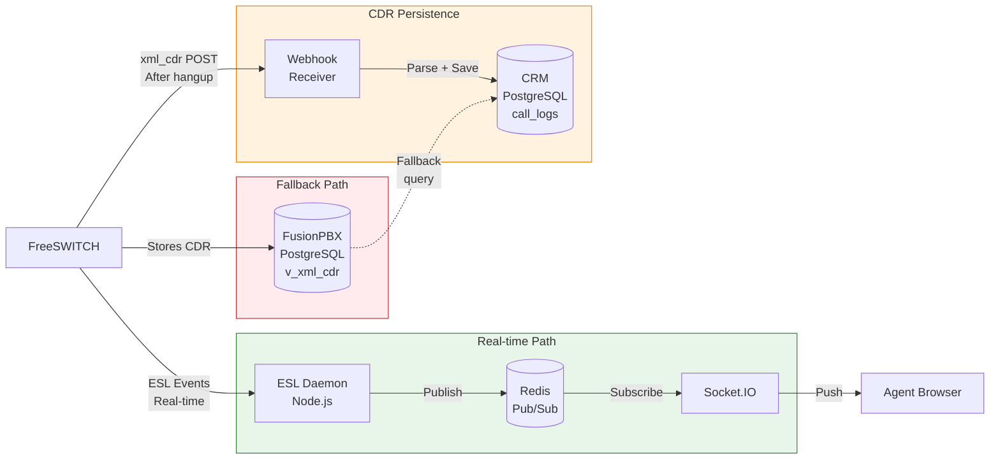

---

## 11. Recording Access Flow

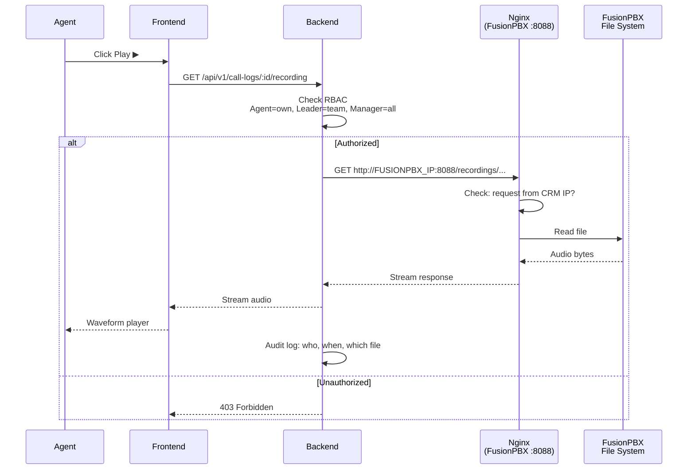

---

## 12. Omnichannel Integration (Phase 2-3)

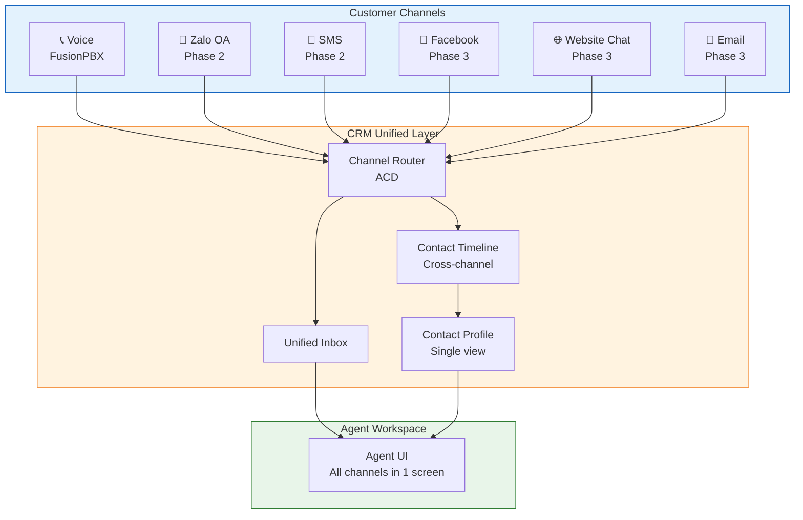

---

## 13. Listen / Whisper / Barge (Monitoring)

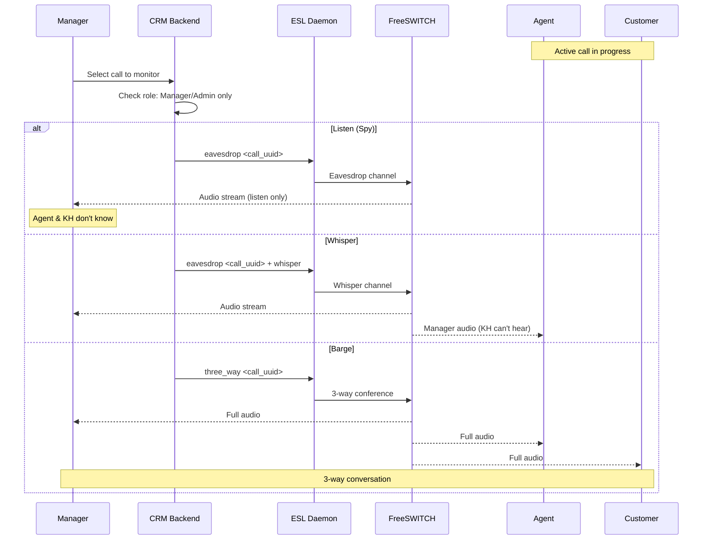

---

*Generated from PRD v2.0 — CRM Omnichannel Telesale & Collection*
